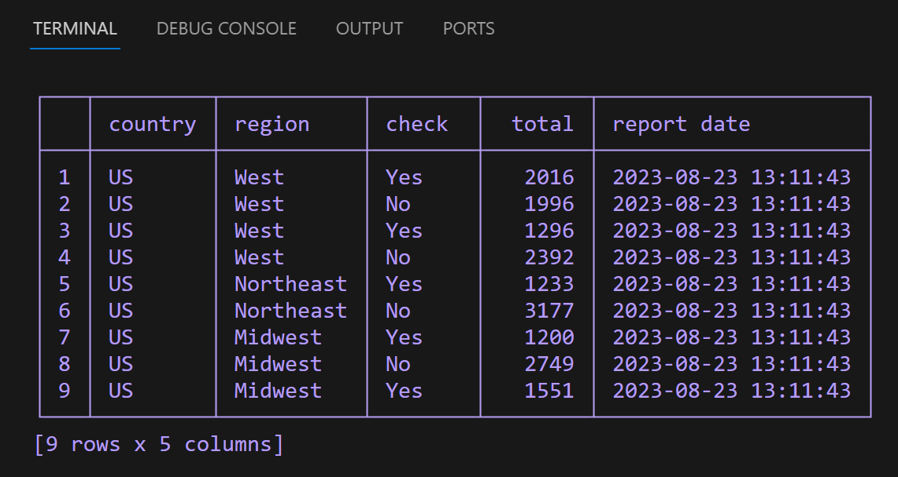
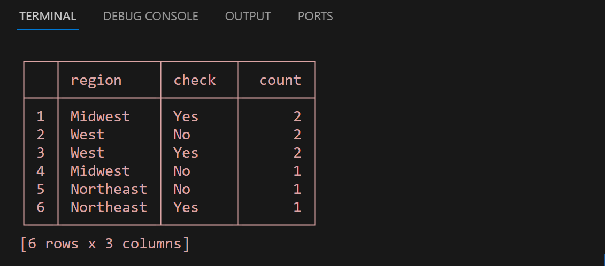

# SQLDataModel
SQLDataModel is a fast & lightweight data model with no additional dependencies for quickly fetching and storing your tabular data to and from the most commonly used databases & data sources in a couple lines of code. It's as easy as ETL:
```python
from SQLDataModel import SQLDataModel as sdm

# do the E part:
my_table = sdm.from_sql("your_table", cx_Oracle.Connection)

# take care of your T business:
for row in my_table.iter_rows():
    print(row)

# finish the L and be done:
my_table.to_sql("new_table", psycopg2.Connection)
```

Made for those times when you need to move data around but the full pandas, numpy, sqlalchemy installation is just overkill. SQLDataModel includes all the most commonly used features, including additional ones like pretty printing your table, at  <span style="font-size: 9pt;">$1/1000$</span> the size, 0.03MB vs 30MB

### Installation
Use the package manager [pip](https://pip.pypa.io/en/stable/) to install SQLDataModel.

```bash
pip install SQLDataModel
```

### Usage

```python
from SQLDataModel import SQLDataModel

# create a SQLDataModel object from any valid source, whether csv:
sdm = SQLDataModel.from_csv('region_data.csv')

# or any DB-API 2.0 connection like psycopg2, cx-oracle, pyodbc, sqlite3:
sdm = SQLDataModel.from_sql('region_data', psycopg2.Connection) 

# or from objects like dicts, lists, tuples, iterables:
sdm = SQLDataModel.from_data(data=region_data, headers=region_headers)

# manipulate it
sdm_sliced = sdm[2:7]

# view it as a table
print(sdm)
```


```python
# group by columns:
sdm_group = sdm.group_by('region','check')
print(sdm_group)
```


```python
# loop through it:
for row in sdm.iter_rows():
    print(row)

# or save it for later as csv:
sdm.to_csv('region_data.csv')

# or to sqlite database:
sdm.to_sql('data', sqlite3.Connection)

# and get it back again as a new model:
sdm_new = SQLDataModel.from_sql('select * from data', sqlite3.Connection)
```
### Contributing

Pull requests are welcome. For major changes, please open an issue first
to discuss what you would like to change.

Please make sure to update tests as appropriate.

### License

[MIT](https://choosealicense.com/licenses/mit/)


Thank you!
Ante Tonkovic-Capin
